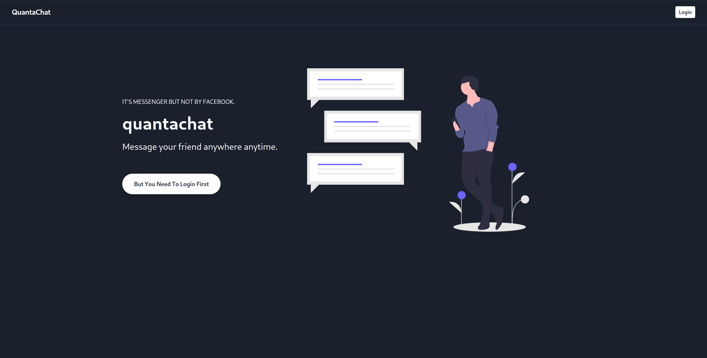
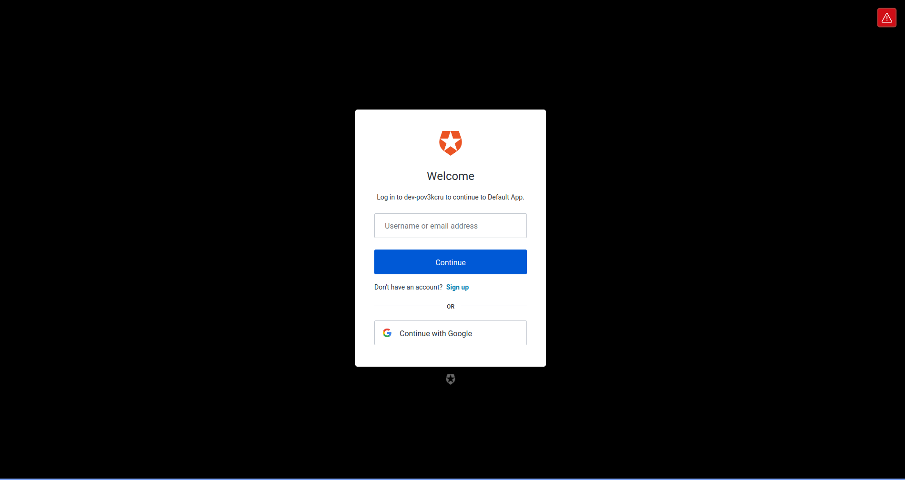

<h1 align="center">GQLChat</h1>

## Quickstart

```sh
git clone https://github.com/coderosh/gqlchat.git
cd gqlchat
yarn install

cd client
yarn install
yarn build:css

cd ..
cp .env.example .env

yarn develop

# or build
yarn build
```

## Screenshots




